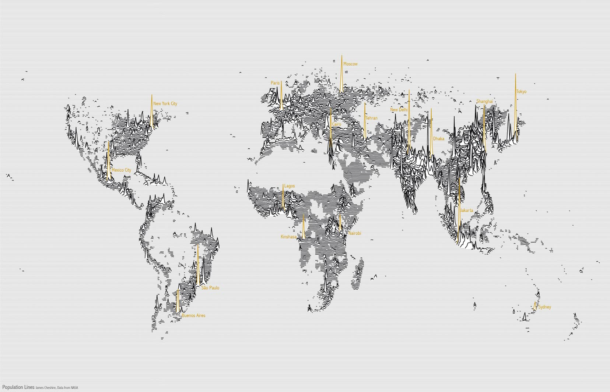

# GIS | SPATIAL ANALYTICS | RESEARCH

Approaching big data solutions to social and environmental sustainability issues with cutting-edge [GIS](https://en.wikipedia.org/wiki/Geographic_information_system) and [data science](https://en.wikipedia.org/wiki/Data_science) techniques, with a focus on [open source](https://en.wikipedia.org/wiki/Open-source_software) software for ensuring reproducibility in my analytical methods.

I consider myself an Environmental Data Scientist in training, but I have over two years of project-based experience with the [Center for Spatial Analysis & Research](https://www.pdx.edu/geography/center-for-spatial-analysis-research-csar) and the [Sustaining Urban Places Research Lab](http://www.suprlab.org/).

This website is a work in progress and will have more content soon, but feel free to explore my [work](http://www.alectrusty.com/projects) and [contact](http://www.alectrusty.com/contact) me with any questions or inquries. I am currently available for GIS & data consulting services and would love to connect.

-Alec

*Source: spatial.ly*